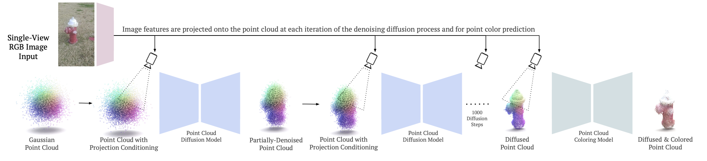

<div align="center">    

## PC^2 Projection-Conditioned Point Cloud Diffusion for Single-Image 3D Reconstruction
### CVPR 2023 (Highlight)

[](https://arxiv.org/abs/2302.10668)
[](https://arxiv.org/abs/2302.10668)
</div>
 
## Table of Contents

- [Overview](#overview)
  * [Explanatory Video](#explanatory-video)
  * [Code Overview](#code-overview)
  * [Abstract](#abstract)
  * [Examples](#examples)
  * [Method](#method)
- [Running the code](#running-the-code)
  * [Dependencies](#dependencies)
  * [Data](#data)
  * [Training](#training)
  * [Sampling](#sampling)
  * [Pretrained checkpoints](#pretrained-checkpoints)
  * [Common issues](#common-issues)
- [Acknowledgement](#acknowledgement)
- [Citation](#citation)

## Overview

### Explanatory Video

<div align="center"> <a href="https://www.youtube.com/watch?v=kAkwpsT1pRA"></a></div>

### Code Overview

This repository uses [PyTorch3D](https://github.com/facebookresearch/pytorch3d) for most 3D operations. It uses [Hydra](https://hydra.cc/docs/intro/) for configuration, and the config is located at `config/structured.py`. The entrypoints for training are `main.py` for the point cloud diffusion model and `main_coloring.py` for the point cloud coloring model. There are shared utilities in `diffusion_utils.py` and `training_utils.py`. The data is [Co3Dv2](https://github.com/facebookresearch/co3d). 

I substantially refactored the repository for the public release to use the `diffusers` library from HuggingFace. As a results, most of the code is different from the original code used for the paper. Only the Co3Dv2 dataset is implemented in this version of this code, but it should be easy to run on other datasets if you need to. 

If you have any questions or contributions, feel free to leave an issue or a pull request. 

### Abstract

Reconstructing the 3D shape of an object from a single RGB image is a long-standing and highly challenging problem in computer vision. In this paper, we propose a novel method for single-image 3D reconstruction which generates a sparse point cloud via a conditional denoising diffusion process. Our method takes as input a single RGB image along with its camera pose and gradually denoises a set of 3D points, whose positions are initially sampled randomly from a three-dimensional Gaussian distribution, into the shape of an object. The key to our method is a geometrically-consistent conditioning process which we call projection conditioning: at each step in the diffusion process, we project local image features onto the partially-denoised point cloud from the given camera pose. This projection conditioning process enables us to generate high-resolution sparse geometries that are well-aligned with the input image, and can additionally be used to predict point colors after shape reconstruction. Moreover, due to the probabilistic nature of the diffusion process, our method is naturally capable of generating multiple different shapes consistent with a single input image. In contrast to prior work, our approach not only performs well on synthetic benchmarks, but also gives large qualitative improvements on complex real-world data.

### Examples


### Method




## Running the code

### Dependencies

Dependencies may be installed with pip:
```bash
pip install -r requirements.txt
```

PyTorch and PyTorch3D are not included in `requirements.txt` because that sometimes messes up `conda` installations by trying to re-install PyTorch using `pip`. I assume you've already installed these by yourself. If not, you can use a command such as:

```bash
mamba install pytorch torchvision pytorch-cuda=11.7 pytorch3d -c pytorch -c nvidia -c pytorch3d
```

### Data

For our data, we use [Co3Dv2](https://github.com/facebookresearch/co3d). Full information about the dataset is provided on the GitHub page. 

We train on individual categories, so you can just download one category or a subset of the categories (for example hydrants or teddy bears). 

Then you can set the environment variable `CO3DV2_DATASET_ROOT` to the dataset root:
```bash
export CO3DV2_DATASET_ROOT="your_dataset_root_folder"
```

### Training

The config is in `config/structured.py`. 

You can specify your job mode using `run.job=train`, `run.job=train_coloring`, `run.job=sample`, or `run.job=sample_coloring`. By default, the mode is set to `train`.

An example training command is:
```bash
python main.py dataset.category=hydrant dataloader.batch_size=24 dataloader.num_workers=8 run.vis_before_training=True run.val_before_training=True run.name=train__hydrant__ebs_24
```

To run multiple jobs in parallel on a SLURM cluster, you can use a script such as:
```bash
python scripts/example-slurm.py --partition ${PARTITION_NAME} --submit
```

Separately, you can train a coloring model to predict the color of points with fixed locations in 3D space.

An example command is:
```bash
python main_coloring.py run.job=train_coloing model=coloring_model run.mixed_precision=no dataset.category=hydrant dataloader.batch_size=24 run.max_steps=20_000 run.coloring_training_noise_std=0.1 run.name=train_coloring__hydrant__ebs_24
```

### Sampling

For sampling point clouds, use `run.job=sample`.

For example:
```bash
python main.py run.job=sample dataloader.batch_size=16 dataloader.num_workers=6 dataset.category=hydrant checkpoint.resume="/path/to/checkpoint/like/train__hydrant__ebs_24/2022-11-01--17-04-36/checkpoint-latest.pth" run.name=sample__hydrant__ebs_24
```

Results will be saved to your output directory.

Afterwards, you can predict colors using the point clouds obtained from the sampling procedure above, specifying them with the argument `run.coloring_sample_dir`.

For example:
```bash
python main_coloring.py run.job=sample_coloing dataset.category=hydrant dataloader.batch_size=8 model=coloring_model checkpoint.resume="/path/to/coloring/model/checkpoint-latest.pth" run.coloring_sample_dir="/path/to/sample/dir/like/sample__hydrant__ebs_24/2022-09-22--18-03-20/sample/" run.name=sample_coloring__hydrant__ebs_24
```

_Side note:_ although this is called "`sample_coloring`" in the code, it is not really doing any sampling because the coloring model is deterministic.

### Pretrained checkpoints

You can download example checkpoints here:
```bash
# Downloads checkpoint and logs (1.2G)
bash ./scripts/download-example-logs-and-checkpoints.sh
# Downloads visualizations over the course of training, as an example. Since
# these are large (3.5G), we have made them a separate download.
bash ./scripts/download-example-vis.sh
```
These are newly-trained models with this codebase. We can train and upload models for other categories as well if you would like; just let us know.

### Common issues

(1) If you get an error of the form `Error building extension '_pvcnn_backend'`, make sure you have installed `gcc` and `g++`. Then check the path in `model/pvcnn/modules/functional/backend.py` and edit it to your desired location.

(2) I believe PyTorch3D has some large changes recently and it is possible some of their code is now broken. I am using version 0.7.3 with a patch on line 634 of `pytorch3d/implicitron/dataset/frame_data.py`.
```python
image_rgb = torch.from_numpy(load_image(self._local_path(path)))
```

(3) You may also have to patch the `accelerate` library in order to properly batch the `FrameData` objects from PyTorch3D. To fix this I replaced the following lines in `accelerate/utils/operations.py` (L91-99)
```python
elif isinstance(data, Mapping):
    return type(data)(
        {
            k: recursively_apply(
                func, v, *args, test_type=test_type, error_on_other_type=error_on_other_type, **kwargs
            )
            for k, v in data.items()
        }
    )
```
with the following lines
```python
elif isinstance(data, Mapping):
    from pytorch3d.implicitron.dataset.data_loader_map_provider import FrameData
    if isinstance(data, (FrameData)):
        return type(data)(
            **{
                k: recursively_apply(
                    func, v, *args, test_type=test_type, error_on_other_type=error_on_other_type, **kwargs
                )
                for k, v in data.items()
            }
        )
    else:
        return type(data)(
            {
                k: recursively_apply(
                    func, v, *args, test_type=test_type, error_on_other_type=error_on_other_type, **kwargs
                )
                for k, v in data.items()
            }
        )
```

## Acknowledgement

* The [PyTorch3D](https://github.com/facebookresearch/pytorch3d) library. 
* The [diffusers](https://github.com/huggingface/diffusers) library. 
* The [Co3D and Co3Dv2](https://github.com/facebookresearch/co3d) datasets. 
* _Our funding:_ Luke Melas-Kyriazi is supported by the Rhodes Trust. Andrea Vedaldi and Christian Rupprecht are supported by ERC-UNION-CoG-101001212. Christian Rupprecht is also supported by VisualAI EP/T028572/1.

## Citation   
```
@misc{melaskyriazi2023projection,
  doi = {10.48550/ARXIV.2302.10668},
  url = {https://arxiv.org/abs/2302.10668},
  author = {Melas-Kyriazi, Luke and Rupprecht, Christian and Vedaldi, Andrea},
  title = {PC^2 Projection-Conditioned Point Cloud Diffusion for Single-Image 3D Reconstruction},
  publisher = {arXiv},
  year = {2023},
}
```