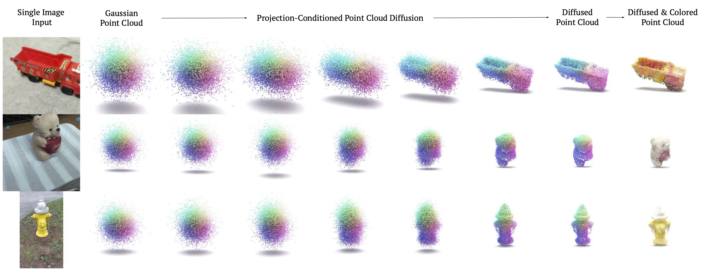
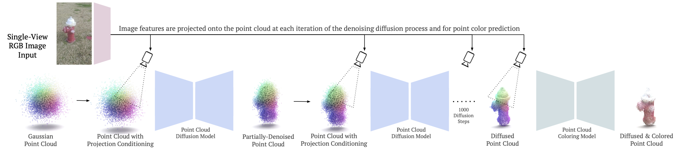

<div align="center">    

## PC^2 Projection-Conditioned Point Cloud Diffusion for Single-Image 3D Reconstruction
[](https://arxiv.org/abs/2302.10668)
<!-- [](https://papers.nips.cc/book/advances-in-neural-information-processing-systems-31-2018)   -->
</div>
 
### Code will be available soon! 

The code will be released by Friday, March 10.

### Abstract
Reconstructing the 3D shape of an object from a single RGB image is a long-standing and highly challenging problem in computer vision. In this paper, we propose a novel method for single-image 3D reconstruction which generates a sparse point cloud via a conditional denoising diffusion process. Our method takes as input a single RGB image along with its camera pose and gradually denoises a set of 3D points, whose positions are initially sampled randomly from a three-dimensional Gaussian distribution, into the shape of an object. The key to our method is a geometrically-consistent conditioning process which we call projection conditioning: at each step in the diffusion process, we project local image features onto the partially-denoised point cloud from the given camera pose. This projection conditioning process enables us to generate high-resolution sparse geometries that are well-aligned with the input image, and can additionally be used to predict point colors after shape reconstruction. Moreover, due to the probabilistic nature of the diffusion process, our method is naturally capable of generating multiple different shapes consistent with a single input image. In contrast to prior work, our approach not only performs well on synthetic benchmarks, but also gives large qualitative improvements on complex real-world data.

### Examples



### Method




#### Dependencies
*Coming soon*

 <!-- - PyTorch (tested on version 1.7.1, but should work on any version)
 - Hydra: `pip install hydra-core --pre`
 - Other:
 ```
 pip install albumentations tqdm tensorboard accelerate timm 
 ```
 - Optional: 
 ```
 pip install timm wandb
 pip install git+https://github.com/fadel/pytorch_ema
 ``` -->

#### Training
*Coming soon*

<!-- ```bash
python main.py 
```-->

#### Inference / Visualization
*Coming soon*

<!-- ```bash
python main.py job_type="eval"
``` -->

#### Acknowledgements

Luke Melas-Kyriazi is supported by the Rhodes Trust. Andrea Vedaldi and Christian Rupprecht are supported by ERC-UNION-CoG-101001212. Christian Rupprecht is also supported by VisualAI EP/T028572/1.

#### Citation   
```
@misc{melaskyriazi2023projection,
  doi = {10.48550/ARXIV.2302.10668},
  url = {https://arxiv.org/abs/2302.10668},
  author = {Melas-Kyriazi, Luke and Rupprecht, Christian and Vedaldi, Andrea},
  title = {PC^2 Projection-Conditioned Point Cloud Diffusion for Single-Image 3D Reconstruction},
  publisher = {arXiv},
  year = {2023},
}
```
